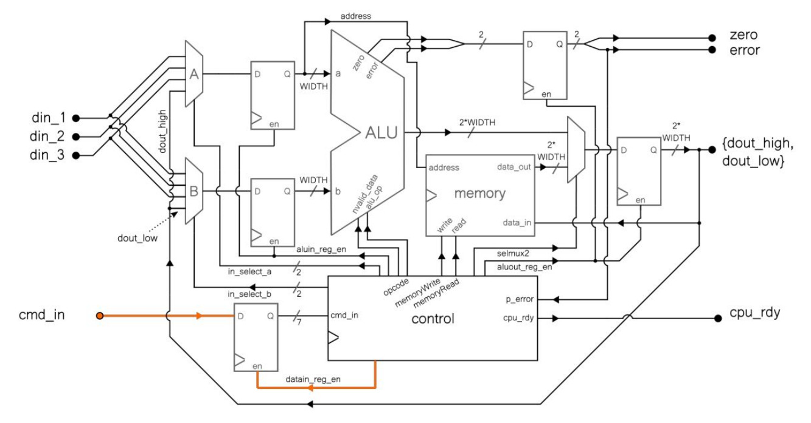
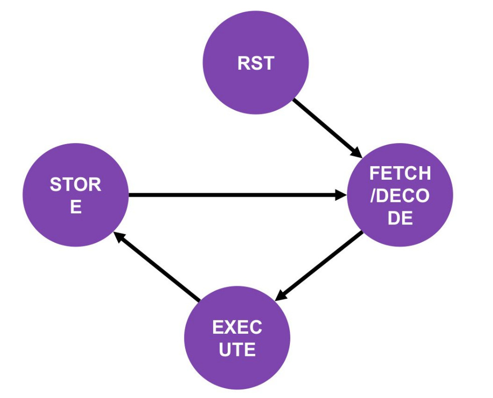

# Santiago CPU

A **Santiago CPU** é uma CPU educacional desenvolvida para estudo de arquitetura de computadores digitais durante o curso **CI Expert**.

O objetivo do projeto é apresentar de forma simples os principais conceitos de uma CPU multiciclo, incluindo:

- Unidade de Controle (FSM)
- Datapath
- ALU
- Banco de Registradores
- Interface de Memória
- Execução baseada em estados

---

# Datapath

A figura abaixo apresenta o datapath da CPU.

---

# Máquina de Estados

A CPU utiliza uma máquina de estados simplificada composta por quatro estados:

